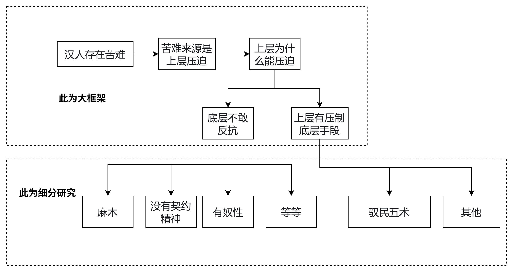
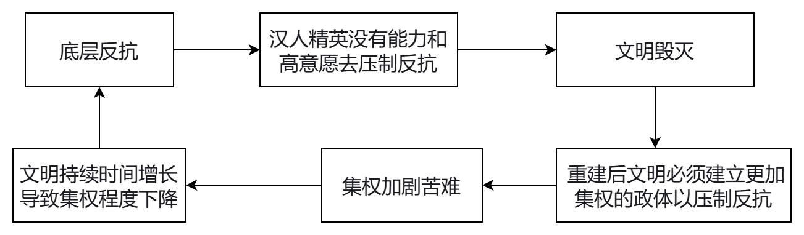
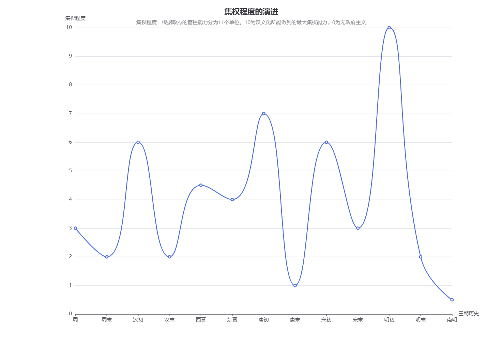
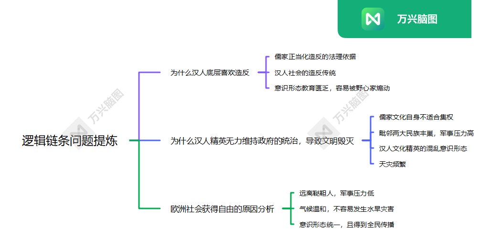
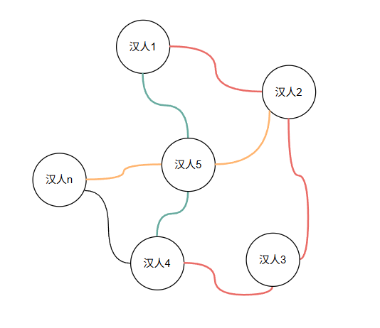
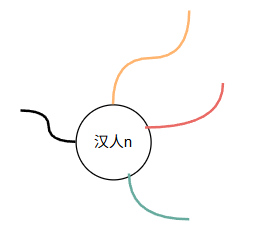

[← 返回首页](/)

# 什么是汉人

最开始做皇汉的时候，会加各种QQ群相互抱团取暖，也会与各路反皇汉群体辩经。辩经的时候，被逼问的最多的一个问题就是“什么是汉”。说来惭愧，即便是大学毕业后的我面对这个问题也是懵懵懂懂的。在当时我所反对的仅仅是对身份证上被标注“民族汉”的一些歧视性政策。

因为我对汉这个概念仅仅是停留在身份证上的那个简体汉字，我所反对的也仅仅是对那个简体汉字所标注的群体的一些歧视性政策。我不知道为什么会“民族汉”能标注一个群体，我也不知道这个“汉民族”从何而来。

所以在当被问到什么是汉人的时候，我脑子是发懵的。当然不仅是我，我在的皇汉群中的其他皇汉也是同样如此。当时群里的皇汉们讨论出了一个比较搞笑的回应，“身份证汉就是汉”。

当然如果以“身份证上的标注是汉，就是汉人”来回应“什么是汉人”这个问题，就会面临比对这个问题发懵更加搞笑的局面。对面一边会拿着黑人血统的身份证汉人来嘲讽你，一边逼问海外的华人是不是汉人（海外华人没有身份证），你若回答是，就会变成不承认自己所定标准的小丑，引来群嘲。永远不要怀疑反皇汉群体的团结程度和言语羞辱能力。

要是以文化加血统的定义，同样会面临“黑人问题”，也会面临问海外一些反华润人是不是汉人，还有历史上造成汉人大量死亡的汉人是不是汉人等等。

总之，在“汉人”这个抽象且模糊的概念下，囊括了很多人，而只要是人就会有不同的思想，不同的行为习惯，不同的政治身份，汉人无疑是一个多元群体，而且汉人是一个民族概念，没有办法像白人，黑人那样直接依靠肤色这种身体特征进行识别。

想从一个多元群体中，找出其共同特征，然后声明此特生为汉民族的独有特征，符合此特征的为汉人，是不可能的事，无论什么样的标准都会举出“汉人”概念囊括之下的其他的群体来嘲讽这个概念，进一步嘲讽这个概念提出的人，进一步嘲讽这个皇汉这个群体。

**人多嘴杂，历史与哲学思辨能力几乎是空白，一腔热血容易爆出极端言论被人利用。这就是皇汉群体的画像。**

我从成为皇汉以来到现在一直都是如此，这个特征造成了，每一次反汉事件，即便是皇汉们声势浩大，但也仅仅是声势浩大，完全无法达成任何实际上的改变。就像一阵风吹过敌人的阵地上的旌旗，刮到敌人脸上，让他们知道皇汉的存在，但是无法阻止他们饮马蜡弦。

当然也不全都不是声势浩大，毫无影响。去年的，《明末·渊虚之羽》暴死，官媒组团批判皇汉和红楼梦索隐，算是皇汉对现实造成了一点小小的影响。

这里插播一条，别以为在东大，只有皇汉群体的意见是被忽略的，这种“声势浩大，毫无影响”的现象还出现在二次元，女权这块。无论二次元的女cos多么的厌男，打击“媚男”女cos，依然能接各种商单挣钱，把cos经济支撑起来的底层宅男们无论在网上说多少话不会产生任何影响。每次女权事件，无论男女对这些事情多么的无法容忍依然没有意义（我见到过很多女的反女权，觉得女权离谱）。还有比较明显的是，每次留学生的超高待遇曝光依然有一群人骂，但是不会有任何改变。这种多数群体嘶吼着噤声，少数群体沉默着惊雷。这种现象在东大是普遍性的。皇汉群体只是其中之一。

但是即便是力量再弱小，每一个皇汉始终都要面对最开始的那个问题？“什么是汉人”。

这个问题表面来看汉人是个血统概念，你我之所以是汉人，必然是因为父母一方为汉人。但是如果细究这个定义就会变得复杂起来，还是最开始的发问，父母一方为黑人白人这种与汉人有着很大的人种差距的人算不算汉人？即便是双方父母都是汉人，但是他本人并不认同自己汉人，认同为日本人，美国人，或者是一个左人，认为民族是虚构的，一切都是阶级。这种人难道能算汉人。

如果紧扣某种概念，身份证或者血统，符合这些概念的人都是汉人。这个概念之下，必然有精美，精日，必然有数量众多的左人团结人。

那么，皇汉们，你们到底是在做什么呢？如果你是在为汉人争取权益，恢复汉人往日荣光，那么精美，精日，左人，团结人，他们本身也是汉人。但是，皇汉们有没有想过，“争取汉人权益，恢复汉人往日荣光”，这件事情本身就是在切实的损害，精美，精日，团结人，左人们的利益。

如果你汉人权益争取到了，汉人往日荣光恢复了。

**那我作为精美，精日，我还怎么批判汉民族的劣根性，我还怎么兜售那套西方中心论史观？**

**那我作为团结人，左人，我还怎么批判民族主义，怎么批判封建主义，怎么让马克思主义拯救世界？**

所以，如果皇汉们以往所宣称的，为了民族利益去反对某些观点，去伸张某些主张。但是在写观点和主张，却能实实在在的损害某些汉人利益的时候，被一些汉人明确反对的时候。皇汉们的存在合法性是否也不在那么牢固，将被受到广泛质疑。

定义一个概念，此概念囊括一群人，然后以此概念为名去行动，行动的合法性是概念所囊括的那群人会受益。如此范式，不仅实践上存在重大的困难，在逻辑上也相互矛盾。

所以汉人之名不正，则为汉人利益直言则不顺，为汉人利益之言不顺，则事不成。

以上或许就是这20来年的皇汉运动的一个缩影。

那么，到底什么是汉人，什么是汉民族主义，如何正名。

回答这个问题，的确有点困难，但是如果理一下历史脉络还是能论述一下。

先从汉人苦难之根源讲起。自五四开始汉人的文化先驱就开始不断的批判民族性，所批判的内容，总结下来其实就是：

汉人底层有奴性，不敢反抗上层。汉人上层没有人性，只知道压榨底层维持统治。

何为奴性，这个奴性可以是，顺从懦弱，冷漠麻木，可以是没有逻辑，没有契约精神等等。何为没有人性，商鞅驭民五术。

对于汉人底层与上层的民族性批判从五四到现在一直都是汉人文化先驱所做的。这一些人中，的确有一些人是怀着卑劣的目的去批判汉人民族性，比如狼图腾。但是有一些人，他们的目的是崇高的，他们看到了汉人的苦难，他们想要去解释这些苦难的根源，去除根源以拯救这些苦难的汉人，比如鲁迅。

无论是哪种人，他们的逻辑链条始终是：汉人存在苦难 -> 苦难来源是上层压迫 -> 上层为什么能压迫 -> 因为底层不敢反抗。在这个逻辑链条框架之下展开分析，汉人苦难的根源成了底层为什么斗不过上层的叙事。由此开启了最近这百十来年的批判性叙事。在这个大框架之下产生了大量的细分的民族性批判性著作，当然也有一些依靠客观自然环境分析“为啥底层斗不过上层”问题的，当然不是主流。这段文字可能叙述混乱，可以看下我做的这个图。

根据以上分析可以进一步推理，五四以来的文化先驱们，他们所依据的是，如果底层能斗得过上层，苦难或许就会减少，甚至消失。以此他们也开始兜售他们的学说，理论，并且把自己幻想为了拯救万民于水火的拯救者。都是因为底层太蠢，上层太坏，他们才没有拯救成功。这种思想现在依然是主流思想。

但是，为什么就没有一个人去思考，苦难真的是来源于底层斗不过上层吗？底层斗得过上层以后好日子真回来吗？

最开始我对以上理论深信不疑的，但是就是某种难以修育承认的民族自尊心作祟，导致一些支黑抛出洼地论，文化劣根性这些观点的时候我也只能狡辩式反驳，因为我实在不知道有啥更通顺的理论去解释当下汉人困难的现状。但是面对他们抛出的史料，并附带的解释，我还是想通过一些史料和哲学解释去论述我们或许没有那么不堪，也有存在变化的可能性。

然后我就开始看明朝的历史，儒家的经，还有西方哲学的一些知识。在对历史与哲学的知识掌握到一定程度以后，我才开始意识到不对劲。

例如：

圣经里面，上帝就是个暴君，不要说反抗上帝，即便是信仰不虔诚也会招致上帝的神罚，圣经要求信徒绝对虔诚，绝对服从。相比而言，儒家君君臣臣，父父子子这种权责一致的思想简直大逆不道。

荷马史诗里面神对人更是残暴，神可以随便杀死一个人，然后下凡去强奸女性，毫无道德指责，与荷马史诗相对应的汉人的古早诗歌诗经，人文关怀是在爆表了。我现在也无法理解，那些吹荷马史诗的是什么心态。

西方人的上层他们貌似一直都是上层，底层对上层的战争烈度都很小，上层的家族基本能得以保留。而看到汉人的农民起义烈度则是西方无法比拟的，**汉人底层对上层的屠杀是远超世界上任何一个其他民族的**。既然汉人的反抗烈度和频率远超西方，又何来汉人有奴性一说呢？

大概就是到这里，曾经深信不疑的“底层苦难是因为底层不反抗上层，底层不反抗上层的原因是，底层有奴性，上层懂驭民无人性，总之民族有劣根性，得需要拯救”。这个根深蒂固的观念开始崩塌。

这个根深蒂固的观念是五四塑造了茧房，然后穿越一百多年的时空，把我的思想包裹起来。也或许我本身就是个愚钝的人，我需要在承受支黑，反皇汉群体的一日又一日的嘲讽，我需要用业余两年的时间学习非教科书论述的历史与哲学知识，然后才能一层层的剥开这个茧房，去探索当下汉人困难的真相，个中辛酸苦楚实在难以言说。时代的一粒沙，落在个人身上如同一座山。

汉人文化并不是教育民众做奴隶，相反欧洲文明喜欢教育民众当奴隶。

汉人文化并不是没有人文关怀，相反欧洲文明中的残杀与低人权在文化内核中就体现着。

汉人并没有一直做奴隶，一直在剧烈的反抗上层统治，相反欧洲人一直在臣服上层统治。

所以，当下汉人的苦难根源，并不是因为底层不反抗。

或许真相比较反直觉，汉人苦难的根源，这里提出一个新的逻辑链条，底层反抗 -> 汉人精英没有能力和意愿去压制反抗 -> 文明毁灭 -> 重建后文明必须建立更加集权的政体以压制反抗 -> 文明持续时间增长导致集权程度下降 -> 继续重复以上过程直到明朝为最后一个轮回。

为什么明朝是最后一个轮回，而不是清朝。首先这里讨论的是汉人王朝，所以统治者必须是汉人或者汉化胡人。而清朝，其统治者不是汉人，并且完全没有汉化，而且整个清朝是汉人在不断的满化。清朝以后，虽然统治者换成了汉人，但是无论统治者还是国民，早已经是西化，已经是文化上的西方人与传统汉人相距甚远了。

所以明朝是最后一个汉人依靠汉人自己的文化构筑的国家，以后的时间只是汉人所遭受的被外来文化统治的历史。

上文提出的汉人苦难根源的新逻辑链条，我做了一个图可以直观感受一下：

与历史教科书中所说的古代王朝的历史，是不断集权的过程，但是这个过程也是一种螺旋上升的态势。教科书中过于注重王朝初期的集权手段，表示中央集权进一步加强，但是完全不提古代王朝，政治架构逐渐分权的过程。对于汉人王朝也遵循这个规律，只不过汉人王朝的终点是南明接近无政府主义，所迎来的总崩溃。

根据这个新的汉人困难根源逻辑链条，“底层反抗 -> 汉人精英没有能力和高意愿去压制反抗 -> 文明毁灭 -> 重建后文明必须建立更加集权的政体以压制反抗 -> 文明持续时间增长导致集权程度下降 -> 继续重复以上过程直到明朝为最后一个轮回”，我们可以继续提炼三个问题

问题1：为什么汉人底层喜欢造反

问题2：为什么汉人精英无力维持政府的统治，导致文明毁灭

问题3：欧洲社会获得自由的原因分析

以上每个问题都宏大，每个问题都足以让众多的社会学者穷经皓首。所以我们可以把问题进一步拆分，比如：

1.1 儒家正当化造反的法理依据 1.2 汉人社会的造反传统 1.3 意识形态教育匮乏，容易被野心家煽动

2.1 儒家文化自身不适合集权 2.2 毗邻两大民族丰巢，军事压力高 2.3 汉人文化精英的混乱意识形态 3.3 天灾频繁

3.1 远离鞑靼人，军事压力低 3.2 气候温和，不容易发生水旱灾害 3.3 意识形态统一，且得到全民传播

对于以上逻辑链条和演进问题我也做了两张图，让我们更加清晰的看待问题：

**以上是我对近一百多年对汉文化批判的逻辑手段的总结，针对这些逻辑手段提出反驳，并且提出更加合理的逻辑与解释。**

只有正确的认识什么是汉文化，才能正确的认识什么是汉人，也能明白什么汉人，才能对汉民族主义有更深刻的见解。为了方便表达，下文会将汉族个体简写为汉人，将汉族整体简写为汉族。

在论述汉文化之前，我们必须明确汉人与汉族之间的存在关系。先要声明，我这里所论述的汉人与汉族之间的关系只是一种朴素的实在观察之下的抽象论述，而不是进入到更高维度的哲学层面去论述，我本人也是才疏学浅，无法从哲学层面论述，但是如果这篇文章能火，有更多的人从哲学层面去论述汉人与汉族之间的关系也将会是一件非常有意义的事情。

汉人与汉族之间的大概结构是：汉人 -> 所发生的事实/可能发生事实 -> 事实的集合构成汉族

这里有两个关键点：

1. 构成汉族的并不是一个个的汉人，而是汉人与汉人之间所发生的可能发生的事实
2. 构成汉人的元素中，不仅包括已经发生的事实，还包括可能发生的事实（明朝小说中可能发生的事实也是构成元素）

继续画图

圆圈：表示汉人的个体或者事实个体

线：表示结构

关于事实的组成中个体不需要过多解释，其实就是我们所感知到的实在物。而图中的表示结构的线，其实就是把事实中的对象抽离之后的事件，比如永乐远洋航行这是一个事件，里面没有实体，如果把郑和所带领的明军远洋航行这里就构成了一个对象+结构的事实。

而汉族的整体就是有这些线与圈所组成的事实构成。那么在汉族之下的汉人又是怎样的呢？

结构大概如此，汉人个体参与到具体的事件之中，依托这些事件构成的事实，展现出个体的特性，又会与其他个体产生相互影响。

但以上结构只能用来描述现实世界中，实在的汉人个体与汉族是如何构成的。我们若要描述什么是汉人，那么这个命题中的汉人必然不能再是一个进入到具体事件中的具体个体，而是一个抽象概念。那么如何抽象？

汉人的历史长河中有非常多的重大事实，这些重大事实都有具体的汉人参与其中，比如：

舜帝：协调历法与度量衡（肆觐东后，协时月正日，同律度量衡。修五礼、五玉、三帛、二生、一死贽。在璇玑玉衡，以齐七政）

ps：教科书中所谓的秦始皇大一统，协调文字度量衡，并且作为他的功绩宣传，这个是个当下发明的概念，这种“统一”的功绩古人认可的是舜帝

周公旦：建周礼

孔子：创办并传播儒家

汉武帝：与匈奴之间的举族孤注一掷的战争

朱元璋：明朝建立

崇祯：明朝覆灭

等等

以上都是具体的汉族个体参与到重大事件之中。把这些具体的汉族个体，想象成是一个人，这个人同时参与了这些重大的汉族历史事实。

那么我们想到汉人的时候，自然会想象到这个抽象的汉人所经历的重大历史事实，然后自然而然的也会想象这个汉人经历这些事实之后的性格会如何，也会想象他的性格是怎么样的以至于会造成这些重大的历史事实，同样我们也会给与这个汉人一定的期冀。

**那么这个人就是汉人！**

**在现实中， 能与这个抽象的汉人共情，愿意与这个抽象的汉人共享荣光与苦难的人就可以被判定为汉人！**

**而汉民族主义就是想办法让现实中更多的人与这个汉人共享荣光与苦难的过程！**

行文到此，在理论层面表述清楚什么是汉人，什么是汉民族主义。但是还有个问题如果不去解决，或许还会继续陷入争论不休的局面。这个问题就是，那个可以代表汉族的抽象汉人，他究竟要经历那些重大历史事实。

以下为可以讨论的观点：

首先这些重大历史事实可以根据功能分为困难与荣光两类。在这两类事件之下，又可以分为必要事实与助缘事实。

**苦难必然事实：**

现在我们需要回到上文批判五四以来文化先驱们对汉人历史与文化的阐述那段文字，依据我们在图6中所讨论的汉人当下苦难根源的逻辑链条，那么必然事实大概如下：

1. 儒家的创建
2. 理学的推广
3. 明末农民起义
4. 崇祯死亡
5. 满清入关
6. 南明覆灭

如果以上重大历史事实不发生哪一件，汉人的苦难必然不会发生，所以可以将以上重大历史事实视为苦难事实的必然事实。

另外三种重要程度不如苦难事实的必然事实重要，这里就不展开论述。如果能明确苦难事实的必要事实为何，对其投入感情并深刻的反思。就已经是汉民族主义运动的一大进步了。

以上就是我这两年来对什么是汉人，什么是汉民族主义的一点思考。如果有皇汉能看完此文希望能多多提出一些意见。

---

文章有点虎头蛇尾，最后的哲学论述阶段其实能阐述更多，但是我知识水平太拉能想到的就只有这些了。。。
