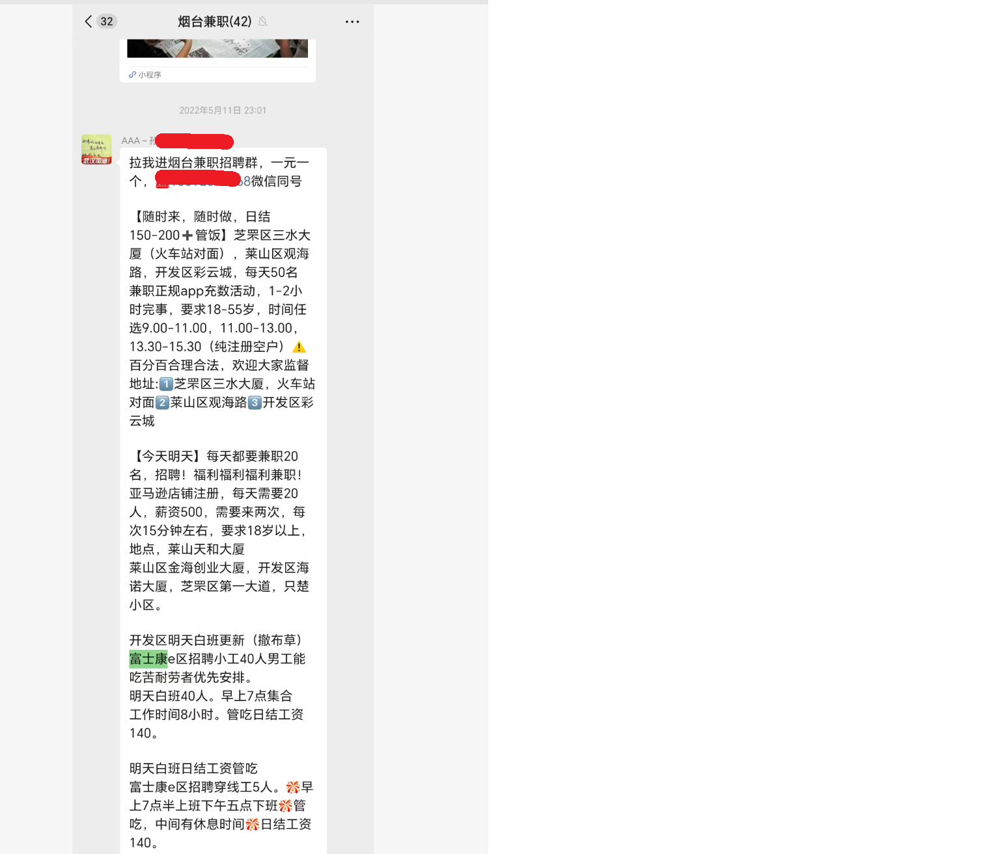

[← 返回首页](/)

# 对于网左融工经历的批驳

事情是这样的QQ群里的网左朋友，给我发了他们线下实践的视频，但是视频我只看了一遍就能确定这个视频基本是瞎编。
视频链接：
【工厂工人实况——两年工厂斗争经验分享】 https://www.bilibili.com/video/BV12f8E66EFQ/?share_source=copy_web&vd_source=b68f064ce89e30d202b4cad84c4905f1

## 视频内容介绍

| 时间                 | 2023/7/19                                                    |
| -------------------- | ------------------------------------------------------------ |
| 工作时长             | 两年                                                         |
| 工厂性质             | 电子厂，手机组装                                             |
| 工厂规模             | 400人左右，组装8条线，每条线40人，包装：十几人。             |
| 工厂地点             | 无详细地址，无大概地址                                       |
| 活动人员             | 3个，作者本人+他的两个同志                                   |
| 入职形式             | 工业园门口，布告栏中的招工信息，打布告中的电话，签空白合同。 |
| 工资待遇             | 直接告知不按劳动法，时薪10元，加班12元,周末加班15元。一个月4000多，和旁边的厂差不多。压工资，每月22日发上个月的工资。工人自动离职不给钱（不正常办完离职手续不给钱）。旷工扣3天工资。 |
| 宿舍环境             | 提供住宿，住宿环境很差，12人一间，没有空调没有热水，床板里面都是臭虫。 |
| 工作时长             | 7.30 ~ 19.30（组装）；12.30 ~ 03.00 （包装A）；19.30 ~09.00（包装B）; 月休两天；计薪时长要去掉30分钟；中午休息时间一个小时； |
| 可能加班             | 19.30~22.30（视频06.09，每天工作15小时，可以证明这里是固定，现在还无法确定这里是加班还是，正常上班） |
| 活动内容             | 下班后1~2个小时，月休的2天交朋友，几个月下来30个朋友         |
| 自动离职不给钱的原因 | 不批准辞职，需要排队，排队时间8个月，如果没有批准辞职就不结压的工资。半年左右四百个普工换一轮。每个离职的人会被压7,8000。仅拖欠不给的工资半年下来2百万。 |
| 保安形象             | 保安队长老板亲戚，保安会推搡闹事者，保安会对要工资的员工进行暴力行为。 |
| 斗争目标             | 正常离职，正常拿到压的工资                                   |
| 斗争过程             | 核心3人制定计划，分批次给15个（视频原文是十几个，这里暂定15）关系最好的朋友思想动员。 |
|                      | 早晨上班的时候宣布不干，然后近20个人组成先锋队成员开始在厂里各个产线活动，号召，员工们一起离职。 |
|                      | 以上流程结束，20几个人。                                     |
|                      | 这20几个人劳动局立案                                         |
|                      | 第二天于进厂于保安发生冲突，报警，抓到保安犯法的把柄，成功让警察占到员工这一边 |
|                      | 劳动局介入，抓住老板，触犯法律的把柄，让劳动局偏向员工一边，拿到被扣押的工资。 |
| 斗争结果             | 正常离职，正常拿到压的工资，完成既定目标。                   |
| 后续                 | 培养了一个工友作为自己的同志。曾经软弱的工友成为了，意志坚定的革命战士。 |

## 问题整理

1. 23年电子厂，10元一小时，加班12。

   我在我微信的聊天记录中，找到了一个22年的山东烟台富士康临时工招工信息，时薪是 15.5元/19元 [1]，在23年的时候，哪个地方的电子厂还能只有10元的时薪？

   他们工作了两年，于工厂签合同，从这两个信息能够判断他们不是临时工，既然不是临时工，那么工资构成就不会是时薪，而是月薪，月薪的计算方式一般是：基本工资 + 绩效 +（其他方面） + 加班工资（这个会按照时薪算）- 各种扣款

2. 工业园区门的告示栏中的招工信息？电子厂一般的普工的招聘都已经被外包给了人力中介，一般园区门口或者园区内部不可能有招工信息，招工信息普遍在中介聚集的地方。如果这个故事的第一步是找中介，会更加真实一些。

3. 签空白合同？如果这里的空白合同是，先给一份合同，合同上的关键信息，比如工资结构，工作时长，服务年限都是空白的，入职签了以后剩下的这些东西人事再写上，最后把完成好的合同交到员工手中。不可能签个空白合同就结束的情况。工厂和员工都不是傻子。
   视频原话，“老板说，工资可以给，你们入职的时候就签了合同，不按劳动法”。再劳动局的同志面前，真的有这种直接说我们厂是违法用工的蠢货老板吗？

4. 宿舍环境，工厂的宿舍没有空调是存在的，但是没有热水不可能。

5. 工资计算（班次A）：8:00 ~ 12:00, 13:00 ~ 19:00, 19.30 ~ 22.30。 此班次合计工作时长，4+6+3 = 13个小时。假设 19:30~22:30 为不加班工资，每天工资为130，每月工资为3640。如果此时间段为加班时间，那么每天工资为136，每月工资为3808
   周末工资为：13*15 = 195.如果休息的那两天都是为周末，那么那么以上的工资水平应该分别加上130和120，再加上周末工资调整后，每月工资为，3770和3928
   视频中的工作时长这里出现了严重混乱，组装生产线的上下班时间和视频 2.30分中叙述的下班时间出现了冲突。根据视频2.30处一天工作时间为13个小时，但是在6.09分处却说有15个小时。
   还有问题是，如果是黑工厂，他们在入职的时候和实际工作的时候给到的的信息是不一样，入职的时候会尽量的好的说，而实际工作的时候会有一些缺点在入职的时候不给出，比如需要扣除餐费，需要工作服，迟到扣款等等。但是这个视频里，入职时工厂所说的和实际上班的情况几乎一致。

6. 下班后1~2个小时交朋友，高强度工作13个小时候还能社交的人，的确是有着钢铁意志有着钢铁之躯的保尔柯察金。大概率就是没有干过这么长时间的工作。

7. 自动离职不给工资。
   400个普工半年大换血，每个普工都拖欠2个月的工资。如果取视频中所说的每个人拖欠7,8000的中值7500，这么一个400人规模的小厂的老板，每年仅通过拖欠员工工资就能获得600w的利润
   我只是感觉这个太夸张，如果这种血汗工厂的小老板都这么能赚，我们国家每年还要给企业提供大量的贷款扶持，然后这些老板他们为什么还要还要贷款呢？贷款不需要给银行额外的利息吗。或许我一个农逼思维，理解不了这其中道道，我只是觉得夸张。
   当然，除了利润之外，这个厂能一直招到人，然后人去了不立马跑路，而是要等着干干不下去了，被白白扣两个月工资再走。

8. 下场直接打人的保安。小厂子的保安，小厂子的保安一般是2个，两个人通过换班的形式维持着厂子里常驻一个保安的情况。在小的县城，城镇，保安工资不会超过3000，担任保安的人员多为接近60或者60岁以上的暮年男性。工作内容，无非就是负责访客登记，厂区大门管理，不间断的巡逻。
   如果是园区，可能公司连保安都不会配备，因为园区的物业会有个统一的保安部门。园区监控，车辆交通，园区大门站岗，访客登记，不定时巡逻。这种情况下保安的确会有年轻保安。
   一个400个人的小厂子，还能有保安队长，还能有上手打人。可能这个厂子的确特殊，保安其实是老板花大价钱雇的镇压工人的打手。

## 叙事结构分析

这个故事是一个非常典型的网左叙事
故事结构如下；

在网左来到世界之前，世界上还黑暗的，世界的大部分人是苦难的。
网左到来之前的世界中的人分为如下结构：
大部分的被沉重剥削，辛苦劳累，麻木且浑浑噩噩，不知道反抗，还甘愿于被剥削的底层无产者。
极少部分的贪得无厌，掌握社会绝大部分财富的上层“老板”
少部分的毫无人性，为老板命令是从的老板养的爪牙
在网左来了以后，他们通过自己掌握的先进，启发底层的无产者们，并且底层无产者们在他们的领导下，运用网左掌握的先进的思想，先进的斗争方法，向上层的老板和老板的爪牙们发起斗争并且取得胜利。
少量的麻木浑浑噩噩，不知反抗的底层npc，获得了救赎升华，成为了那个们的一员。
最后，网左的思想万岁，网左万岁。

当然以上叙事还有个隐藏的点就是，“网左们万岁”或者说“网左们先进”，这个点不会直接提出，但是会通过一些细节来暗示，比如这个视频里，只有少量的有觉悟的，有改变的，被他们中意的人被他们吸收。

这个故事的问题是，假设，网左到来之前的世界的确如他们所预设的那般黑暗，我们获得幸福为什么就只有跟随网左去斗争，然后取得斗争胜利者一条路呢？
难道不能润，难道不能躺平吗？像三和大神一样，干一天玩三天（当然现在干一天200的话，能玩五六天了），这样不也是在逃离吗。
还有我实在没有办法接受他们对底层平民的描述，因为我本人也是底层平民，我至少知道干的不开心就润，要是扣我2个月的工资我肯定会闹，我肯定也会告诉其他人，这个厂子是个黑厂子，不让别人过来。
不可能扭曲到，被打了不知道喊疼，自己的工资被扣了不知道闹，埋头苦干不表现情绪，把情绪压抑到内心然后的等待着被网左拯救时激烈爆发的npc。

当然视频中的故事结构，受制于现实，他们没有办法把故事写的如叙事那么完美，网左运动以后拿到了属于他们所得的，发展了新的成员，然后400人的黑心工厂依然在运行。此故事如果不受制于现实，或许老板早已经吊到了路灯上。

## 附录

1. 2022年山东烟台兼职工资水平
