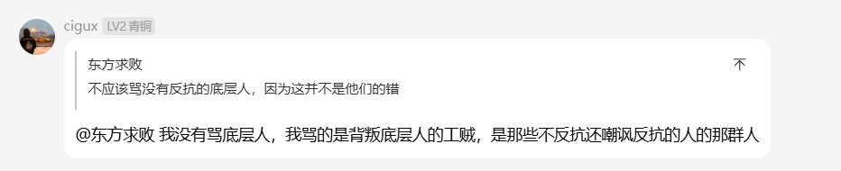
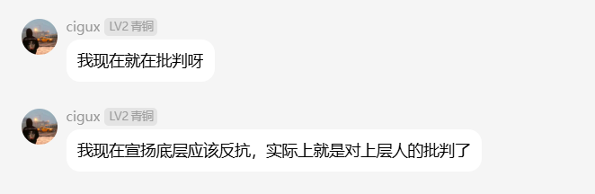
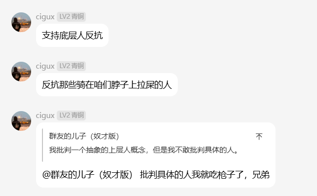

[← 返回首页](/)

> 他们手里的红旗是旧时代留下的，他们嘴里的怒吼是新时代逼出的。 他们试图用一柄早已在历史上证明会带来巨大灾难的旧钥匙，去开一把今天社会不公的新锁——这种行动在形式上充满了讽刺与戏剧性，但在本质上，却是一个社会在缺乏正常批判渠道与制度解药时，所必然爆发的政治梦呓。
> 以上文字源自知乎: https://www.zhihu.com/question/9514724779/answer/2067755700374319194

所谓的网左的红旗是旧时代留下的，这个的确是，闹钟的网左人均猫粉，反安托西修（安那其，托派，西马，修正）
但是他们嘴里的怒吼是新时代逼出来的，这个就值得商榷了。
我在QQ群和网左辩论3个月了，他们自己也宣称他们作为左是被逼的，可问题是谁逼的他们?
当下的网左，10个里面9个是学生，另外一个是体制内、打工人、富二代随机选择。
这三个来月，我辩论过的网左没有不下50个了，其中就一个是在厂子里的打工人，见到过两个体制内的，还有个red3，剩下的全部都是学生。

**我就想问了，在学校里念书的学生，生活费用由父母提供，也不会去打工。新时代到底要怎么逼得着他们 ?!**

当然他们产生的原因与所谓的压迫，正义没有任何关系，仅仅是因为闹钟教育的主流叙事依然是英雄拯救苦难万民的叙事。他们这些人都想要当“鲁迅”而已。

下面贴一点聊天记录产生的资料，以证明他们对底层的态度

上图：我为底层发声，争取利益，但是只有部分人才配当底层
往左眼里，底层人如果不是愿意去罢工，愿意去反抗的底层人就不是底层人，叫工贼。

上图：骂底层就等于批判上层，网左经典的辩证思维

上图：当然了，他们也不傻，他们自然是不敢反抗的，只敢骂底层人和偶尔批判两句资本家，真该批判谁他们知
道，但是他们不敢

网左有什么进步性不清楚，但是他们就是一群：
> 自以为掌握了某种拯救世界的真理，然后开始以此真理开始批判社会，如果社会中的他们所指定的
下层人不按照他们的意思去行动，就会挨他们的骂，什么奴性，什么千年洼地，什么工贼，底层互
图，当然骂那啥滞纳猪的也有，有什么骂什么。当然了，他们不会去骂上层，因为他们不傻，也
没这个胆子，所以只会把责仁转嫁于下层。

他们骂底层的时候他们还不觉得自己是在骂人，诋毁人，他们觉得自己是在拯救人，启蒙人，觉醒
人?

**所以他们就是一群有着智识优越感的精神人上人，相信他们所言的平等，无产者万岁必然会被他
们坑害。**

至于为什么说他们都是想做当代鲁迅呢?
各位仔细想一下，当年新文化运动时期那些人（尤其是鲁迅之流），他们就是不断的骂我们，他们一边骂我们还不觉得是骂我们，还说成是在拯救我们。他们一边骂我们不敢反抗，然后自己灰溜溜的跑到政府部门任职。这种为权力服务的低鬼，有什么资格骂不敢反抗的人?
